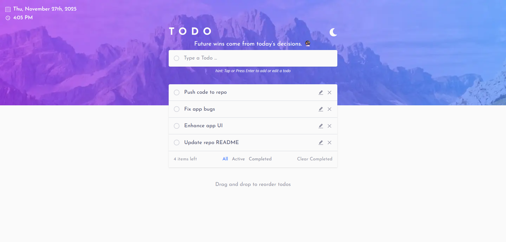

# Todo App

A modern, feature-rich Progressive Web App (PWA) built with React, TypeScript, TailwindCSS. Drag-and-drop reordering, responsive interface that works seamlessly on desktop and mobile devices.

## ✨ Features

- ✅ Create, read, update, and delete todos
- 🎯 Drag-and-drop reordering with SortableJS
- 📅 Date formatting with date-fns
- 💾 State management with Zustand
- 🎨 Beautiful UI with Tailwind CSS
- ⚡ Lightning-fast with Vite
- 🔍 Type-safe with TypeScript
- 📱 Progressive Web App (PWA) - Install on any device

## 🛠️ Tech Stack

- **Frontend Framework:** React 18
- **Build Tool:** Vite
- **Language:** TypeScript
- **State Management:** Zustand
- **Styling:** Tailwind CSS
- **Drag & Drop:** react-sortablejs
- **Date Utilities:** date-fns

## Screenshots



## 📋 Prerequisites

Before you begin, ensure you have the following installed:

- Node.js (v18 or higher)
- pnpm or yarn

## 🚀 Getting Started

### 1. Clone the Repository

```bash
git clone https://github.com/mohamedhesham221/advanced-todo-app
cd todo-app
```

### 2. Install Dependencies

```bash
pnpm install
# or
yarn install
```

```bash
pnpm run dev
# or
yarn dev
```

The app will be available at `http://localhost:5173`

### 6. PWA Features

This app is a Progressive Web App, which means:

- **Installable:** Users can install the app on their device (mobile or desktop) for a native app-like experience
- **Offline Support:** The app works offline thanks to service worker caching
- **Responsive:** Optimized for all screen sizes

To test PWA features in development, you may need to build and preview the production version:

```bash
npm run build
npm run preview
```

Then open the app in your browser and look for the "Install" prompt or check the browser's install menu.

## 🏗️ Project Structure

```
todo-app/
├── src/
│   ├── components/        # React components
│   ├── context/          # init theme-related context
│   ├── providers/        # Context providers
│   ├── store/            # Zustand store
│   ├── hooks/            # Custom React hooks
│   ├── types/            # TypeScript types
│   ├── utils/            # Utility functions
│   ├── App.tsx           # Main app component
│   └── main.tsx          # App entry point
├── public/               # Static assets
├── index.html            # HTML entry point
├── package.json          # Dependencies
├── tsconfig.json         # TypeScript configuration
├── vite.config.ts        # Vite configuration
└── tailwind.config.js    # Tailwind CSS configuration
```

## 📦 Build for Production

```bash
pnpm run build
# or
yarn build
```

The built files will be in the `dist` directory, ready to be deployed.

## 🚢 Deployment

You can deploy this app to various platforms:

## 🙏 Acknowledgments

- [Vite](https://vitejs.dev/)
- [React](https://react.dev/)
- [Zustand](https://github.com/pmndrs/zustand)
- [Tailwind CSS](https://tailwindcss.com/)
- [SortableJS](https://sortablejs.github.io/Sortable/)
- [date-fns](https://date-fns.org/)

---

Made with ❤️ using modern web technologies
